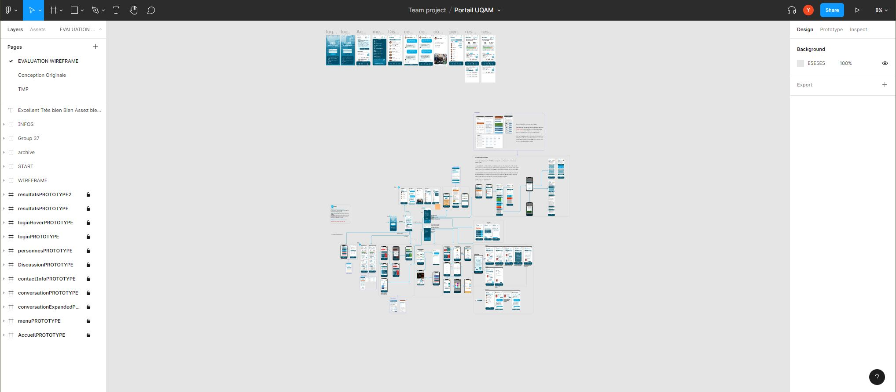
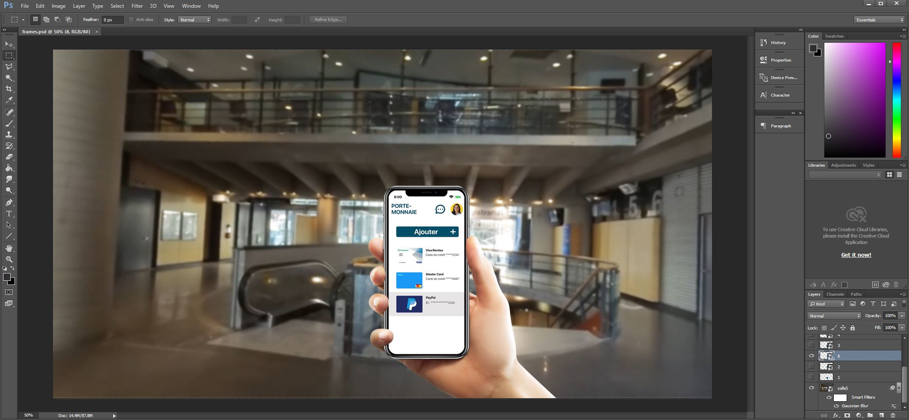
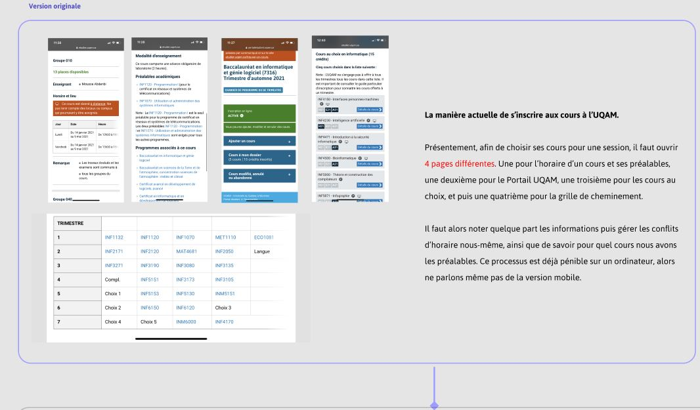
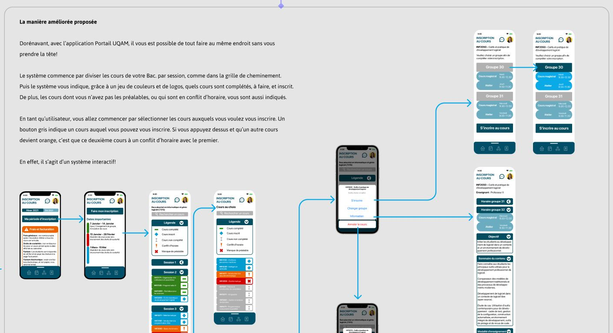

# Portail UQAM - Redesign
UX Designe d'une application mobile pour le Portail étudiant UQAM

**Lien Figma:** https://www.figma.com/file/eiEOCM2ZiN8o23jiCIUsqQ/Portail-UQAM?node-id=858%3A4632 

**Présentation animée:** https://youtu.be/S5iBCSLOyqY

## Auteurs
### UX Design - Figma
- Hamza Yahi
- Yacine Sehboub
- Adel Ouldzeid
- Yassine Tahiri
- Ayoub Baia

### Présentation et démo - Photoshop
Yacine Sehboub

# Présentation du cours
Dans le cadre du cours Interfaces Personnes-machines, nous avons conçu des interfaces personnes-machines à l'aide de méthodes éprouvées. Ils nous ont été présentés des matériels de support pour les interfaces et des modèles cognitifs et typologie des utilisateurs. De plus, nous ont aussi été présentés des outils d'aide à la conception des interfaces.

Concepts: application des principes aux sites WEB, styles des dialogues entre les humains et la machine, classification des interfaces et paradigmes en usage, conception de l'aide contextuelle et du guide d'utilisation.

# Description du travail
Le Portail UQAM étudiant, un site web, est archaïque et inadéquat pour son utilisation sur un smartphone. En utilisant les techniques et les connaissances en UX design vue en cours, nous avons retravaillé (un Redesign) le Portail UQAM pour les étudiants.

# Les technologies utilisées
Figma et Photoshop
